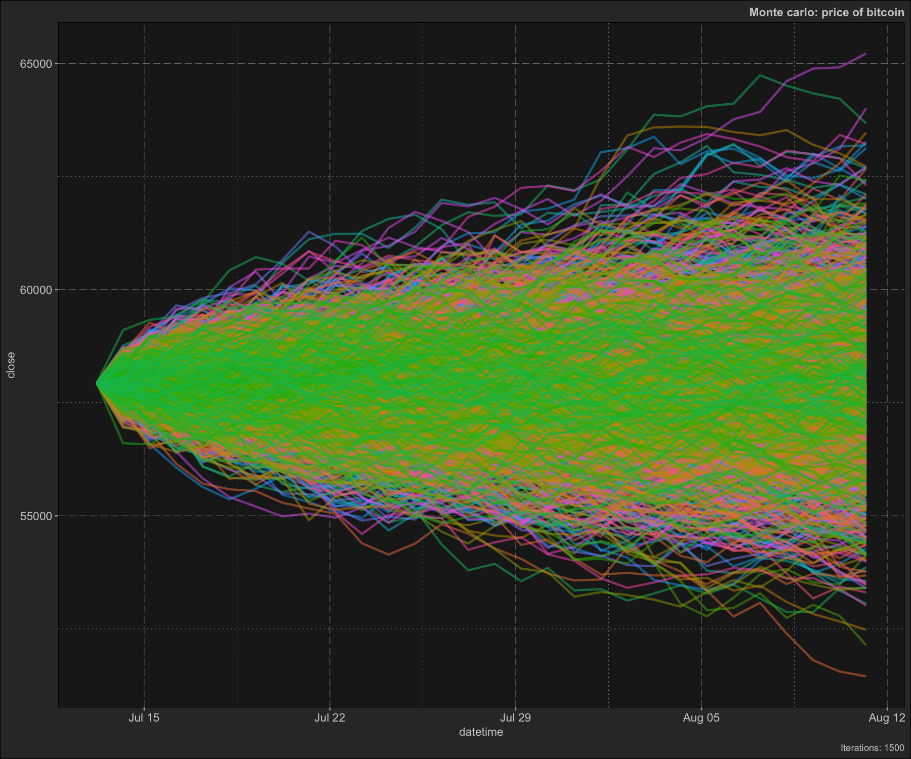
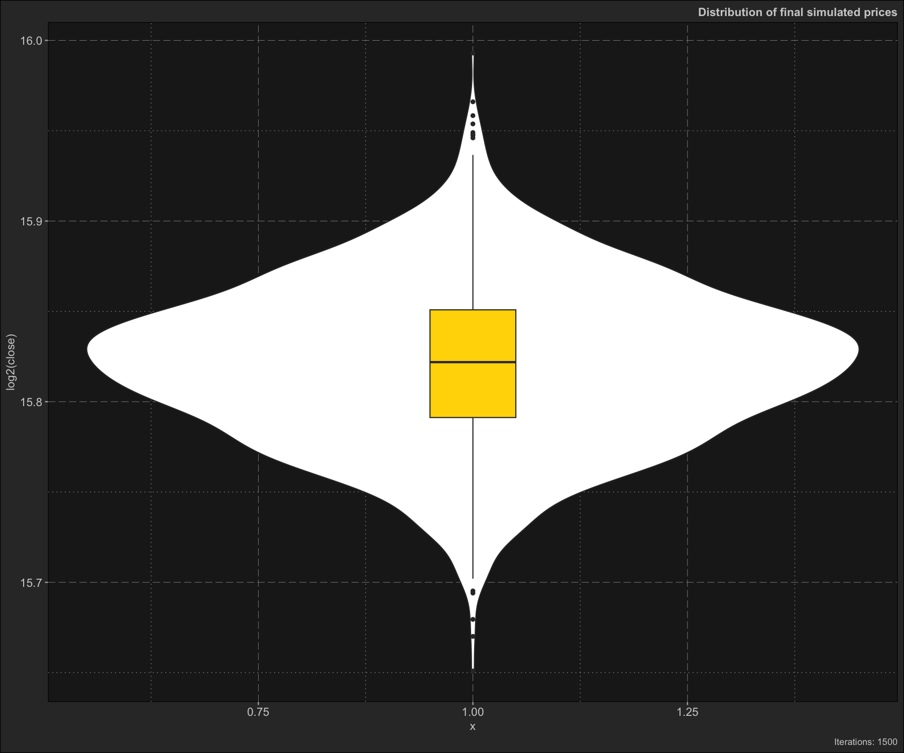
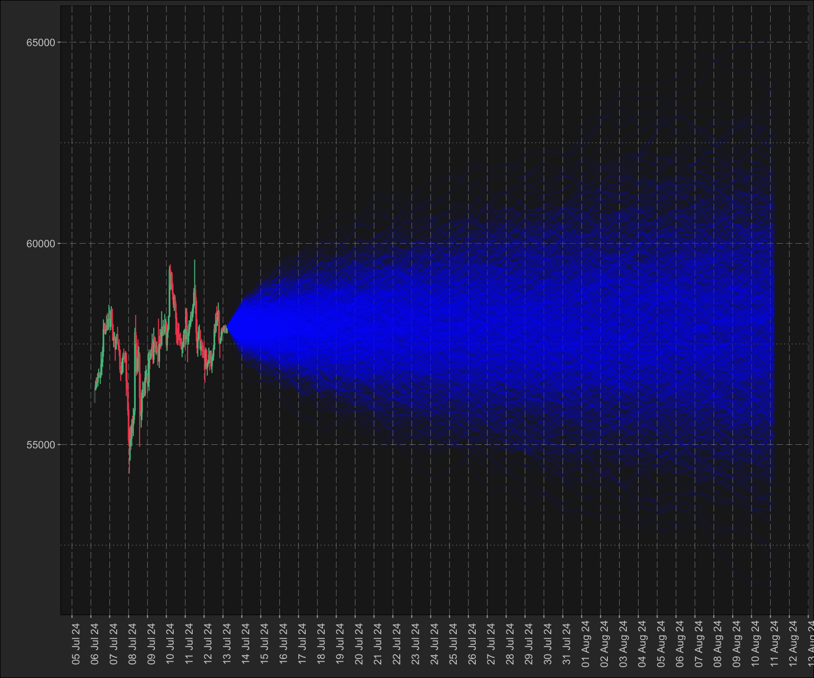
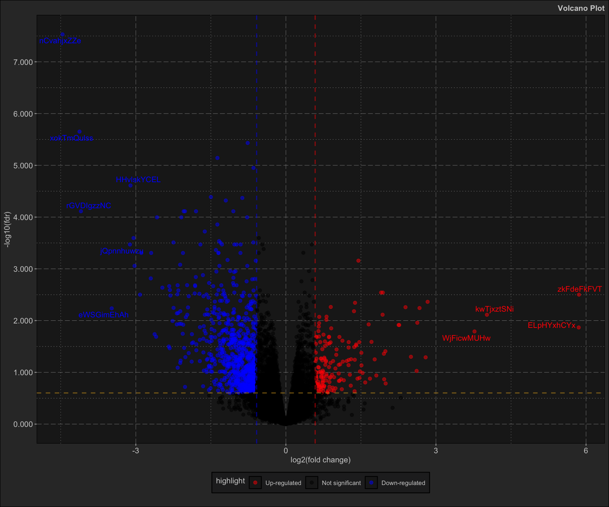
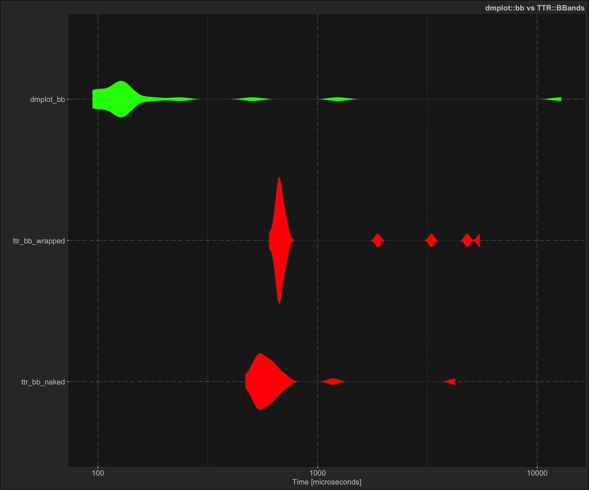

## dmplot

<!-- badges: start -->

[](https://www.tidyverse.org/lifecycle/#experimental)
[](https://travis-ci.org/dereckmezquita/kucoin)
<!-- badges: end -->

`R` framework written in high-performance `C++` and `ggplot2` for
financial, bioinformatics, and time series data analysis.

The package provides algorithms, functions, `ggplot2` layers and most
importantly a framework for working with and analysing financial,
bioinformatics, and time series data.

In short this package is a condensation and accumulation of all of all
the knowledge I’ve gathered over the years spurred on by personal
curiosity and framed by the need for order with a comprehensive
framework.

## Installation

You can install `dmplot` using:

``` r
# install.packages("remotes")
remotes::install_github("dereckmezquita/dmplot")
```

## Load libraries

``` r
box::use(kucoin[ get_market_data ])
box::use(dt = data.table)
box::use(ggplot2)
box::use(dmplot)
```

## Getting started - Finance

### Get financial data

[`kucoin`](https://github.com/dereckmezquita/kucoin) is a package for
interacting with the [kucoin.com API](https://www.kucoin.com) api. You
can use any source of financial data as long as you pass the variables
to the `ggplot2` stat correctly.

``` r
ticker <- "BTC/USDT"

data <- get_market_data(
    symbols = ticker,
    from = lubridate::now() - lubridate::days(7),
    to = lubridate::now(),
    frequency = "1 hour"
)
```

``` r
head(data)
#>      symbol            datetime    open    high     low   close   volume
#>      <char>              <POSc>   <num>   <num>   <num>   <num>    <num>
#> 1: BTC/USDT 2024-07-06 05:00:00 56057.9 56485.8 56025.2 56363.1 79.48139
#> 2: BTC/USDT 2024-07-06 06:00:00 56363.1 56573.3 56346.6 56413.8 41.94569
#> 3: BTC/USDT 2024-07-06 07:00:00 56413.7 56672.4 56402.5 56602.2 98.02022
#> 4: BTC/USDT 2024-07-06 08:00:00 56602.2 56655.3 56508.8 56555.8 49.06419
#> 5: BTC/USDT 2024-07-06 09:00:00 56555.9 56767.0 56441.6 56759.9 42.89421
#> 6: BTC/USDT 2024-07-06 10:00:00 56757.4 56887.1 56645.3 56786.6 45.64148
#> 1 variable(s) not shown: [turnover <num>]
```

NOTE: a demo dataset is included in the `demo/data/` directory.

### Working with and plotting financial data

Here I demonstrate how to use the stats for plotting financial data
along with the theme functions included in this package:

1.  `dmplot::stat_candlesticks()`
2.  `dmplot::stat_bollingerbands()`
3.  `dmplot::stat_movingaverages()`
4.  `dmplot::stat_macd()`

And the theme functions for styling:

1.  `dmplot::theme_dereck_dark()`
2.  `dmplot::theme_dereck_light()`

The `dmplot` framework provides a number of high-performance `C++`
implementations of technical indicators which can be used directly in
the `data.table` `:=` operator. This allows one to leverage the power of
`data.table` and the speed of `C++` for calculations.

1.  `dmplot::bb()` - Bollinger Bands
2.  `dmplot::ema()` - Exponential Moving Average, with wilder argument
3.  `dmplot::macd()` - Moving Average Convergence Divergence
4.  `dmplot::mom()` - Momentum
5.  `dmplot::monte_carlo()` - Monte Carlo simulation
6.  `dmplot::roc()` - Rate of Change
7.  `dmplot::rsi()` - Relative Strength Index
8.  `dmplot::sma()` - Simple Moving Average

One can easily use external packages to calculate indicators as long as
they return a `list` or can be coerced to a `list`.

The reason for this is that we want to impose the use of “Tidy Data”
principles, as this is the convention that `ggplot2` follows and would
allow us to easily build our analyses and plots in layers.

For more information on working with `dmplot` see [Getting started with
the dmplot
framework](articles/getting-started-with-the-dmplot-framwork.html).

#### EMA and Bollinger Bands

Here we demonstrate how one might use an external package to calculate
an indicator such as EMA (`TTR`). `dmplot` also provides a
high-performance `C++` implmentation of `ema` and `bb` which can be used
directly in the `data.table` `:=` operator.

``` r
box::use(TTR[ EMA ])

data2 <- dt$copy(data)

# wrap to return a list
ema <- function(x, n, wilder = TRUE) {
    return(as.list(as.data.frame(EMA(x, n = n, wilder = wilder))))
}

# calculate the short and long moving averages
data2[, ema_short := ema(close, n = 10, wilder = TRUE)]
data2[, ema_long := ema(close, n = 50, wilder = TRUE)]

# use dmplot's C++ implementation of bollinger bands
data2[,
    c("bb_lower", "bb_mavg", "bb_upper", "bb_pct") := dmplot$bb(close, n = 10, sd = 2)
]

tail(data2[, .(datetime, close, ema_short, ema_long, bb_lower, bb_mavg, bb_upper)])
#>               datetime   close ema_short ema_long bb_lower  bb_mavg bb_upper
#>                 <POSc>   <num>     <num>    <num>    <num>    <num>    <num>
#> 1: 2024-07-13 00:00:00 57835.5  57705.34 57599.07 57373.50 57904.35 58435.20
#> 2: 2024-07-13 01:00:00 57879.7  57722.77 57604.68 57381.80 57870.93 58360.06
#> 3: 2024-07-13 02:00:00 57942.8  57744.78 57611.44 57388.49 57853.82 58319.15
#> 4: 2024-07-13 03:00:00 57818.5  57752.15 57615.58 57402.41 57819.27 58236.13
#> 5: 2024-07-13 04:00:00 57779.8  57754.91 57618.87 57501.74 57767.08 58032.42
#> 6: 2024-07-13 05:00:00 57820.6  57761.48 57622.90 57551.86 57790.19 58028.52
```

Because of the `dmplot` framework we can build our analyses and plots in
layers. First we create the candlestick plot and then add the EMA and
Bollinger Bands in separate layers. This would allow us to dynamically
overlay different indicators and analyses.

``` r
candle_plot <- data2 |>
    ggplot2$ggplot(ggplot2$aes(
        x = datetime,
        open = open,
        high = high,
        low = low,
        close = close
    )) +
    ## ------------------------------------
    dmplot$stat_candlestick() +
    ## ------------------------------------
    ggplot2$scale_x_datetime(date_breaks = "1 day", date_labels = "%b %d") +
    ggplot2$labs(
        title = paste(ticker, "- Candlestick with EMA and Bollinger Bands"),
        x = "Date",
        y = "Price (USD)"
    ) +
    dmplot$theme_dereck_dark() +
    ggplot2$theme(axis.text.x = ggplot2$element_text(angle = 45, hjust = 1))

ema_layer <- dmplot$stat_movingaverages(data = data2,
        ggplot2$aes(x = datetime, short = ema_short, long = ema_long),
        alpha = list(mavg = 0.5),
        colour = list("cyan", "magenta")
    )

bb_layer <- dmplot$stat_bollingerbands(data = data2,
        ggplot2$aes(ymin = bb_lower, mavg = bb_mavg, ymax = bb_upper),
        colour = list("pink", "cyan", "cyan")
    )

print(candle_plot + ema_layer + bb_layer)
```


#### MACD

Plotting the MACD (moving average convergence divergence) indicator:

``` r
data2 <- dt$copy(data)

data2[, c("macd", "macd_signal") := dmplot$macd(close, s = 12, l = 26, k = 9)]
data2[, macd_diff := macd - macd_signal]

tail(data2[, .(datetime, close, macd, macd_signal, macd_diff)])
#>               datetime   close      macd macd_signal     macd_diff
#>                 <POSc>   <num>     <num>       <num>         <num>
#> 1: 2024-07-13 00:00:00 57835.5 0.1416409   0.1010757  0.0405651391
#> 2: 2024-07-13 01:00:00 57879.7 0.1474963   0.1103599  0.0371364367
#> 3: 2024-07-13 02:00:00 57942.8 0.1591054   0.1201090  0.0389964272
#> 4: 2024-07-13 03:00:00 57818.5 0.1492232   0.1259318  0.0232913873
#> 5: 2024-07-13 04:00:00 57779.8 0.1344384   0.1276331  0.0068052725
#> 6: 2024-07-13 05:00:00 57820.6 0.1269544   0.1274974 -0.0005429806
```

``` r
macd_plot <- ggplot2$ggplot(data2, ggplot2$aes(x = datetime)) +
    ## ------------------------------------
    dmplot$stat_macd(
        ggplot2$aes(macd = macd, macd_signal = macd_signal, macd_diff = macd_diff)
    ) +
    ggplot2$scale_x_datetime(
        date_breaks = "12 hour", date_labels = "%Y-%m-%d %H:%M"
    ) +
    ggplot2$scale_y_continuous(n.breaks = 15) +
    ggplot2$labs(
        title = paste(ticker, "- MACD"),
        x = "Date",
        y = "MACD Value"
    ) +
    dmplot$theme_dereck_dark() +
    ggplot2$theme(
        axis.text.x = ggplot2$element_text(angle = 45, hjust = 1),
        panel.grid.minor = ggplot2::element_blank()
    )

print(macd_plot)
```


Now let’s do the same plot in a light theme:

``` r
macd_plot +
    dmplot$theme_dereck_light() +
    ggplot2$theme(
        axis.text.x = ggplot2$element_text(angle = 45, hjust = 1),
        panel.grid.minor = ggplot2::element_blank()
    )
```


### Monte Carlo simulation

Here we demonstrate how to use the `dmplot::MonteCarlo()` `R6` class
which uses `C++` under the hood and makes executing a Monte Carlo
simulation extremely simple.

1.  Create a `MonteCarlo` object
2.  Run the simulation
3.  Plot the results

``` r
box::use(dmplot[ MonteCarlo ])

data2 <- dt$copy(data)

monte <- MonteCarlo$new(data, number_sims = 1500, project_days = 30)

# run Monte Carlo simulation
monte$carlo()

monte$plot_prices()
```



``` r
monte$plot_distribution()
```



``` r
monte$plot_prices_and_predictions()
```



## Getting started - Bioinformatics

`dmplot` offers a host of functions for working with bioinformatics
data. Here we demonstrate how to use the `dmplot::Volcano()` `R6` class
to plot a volcano plot.

`dmplot` imposes a convention and standard for the data it expects, in
exchange it offers ease of use and efficiency in plotting and analysing
data.

### Volcano plot

A volcano plot can be generated in 3 easy steps.

``` r
# 1. load the data
data(diff_expr_res, package = "dmplot")

head(diff_expr_res)
#>       feature     log2FC  p_value      fdr
#>        <char>      <num>    <num>    <num>
#> 1: nCvahjxZZe -4.4653827 1.84e-12 2.95e-08
#> 2: xokTmQulss -4.1254298 2.77e-10 2.23e-06
#> 3: EsqEEnrrMA -0.7639582 6.92e-10 3.70e-06
#> 4: MesqnUNFSM -1.3692713 1.79e-09 7.20e-06
#> 5: vHRmtdhRnW -0.6481394 3.48e-09 1.12e-05
#> 6: HHvlskYCEL -3.1067641 9.15e-09 2.45e-05

# 2. create the Volcano object
volc <- dmplot$Volcano$new(diff_expr_res)

# 3. plot the volcano plot
volc$plot_volcano()
```



## Benchmarking `dmplot`’s high-performance C++ technical indicators

Here we do a simple demonstration and benchmark of `dmplot`’s Bolinger
Bands implementation vs the `TTR` package. Note that despite using a
version not wrapped to return a `list` the `TTR` implementation is still
significantly slower than `dmplot`’s C++ implementation.

``` r
box::use(microbenchmark[ microbenchmark ])
box::use(TTR[ BBands ])

ttr_bb_wrapped <- function(close, n = 2, sd = 2) {
    return(as.list(as.data.frame(BBands(close, n = n, sd = sd))))
}

benchmark_reps <- 10L
time_interval <- 5L
standard_dev <- 2L

single_micro <- microbenchmark(
    ttr_bb_naked = BBands(data$close, n = time_interval, sd = standard_dev),
    ttr_bb_wrapped = ttr_bb_wrapped(data$close, n = time_interval, sd = standard_dev),
    dmplot_bb = dmplot$bb(data$close, n = time_interval, sd = standard_dev),

    times = benchmark_reps
)


ggplot2$autoplot(single_micro) +
    dmplot$theme_dereck_dark() +
    ggplot2$geom_violin(ggplot2$aes(fill = expr), linewidth = 0.25) +
    ggplot2$scale_fill_manual(
        values = c("ttr_bb_naked" = "red", "ttr_bb_wrapped" = "red", "dmplot_bb" = "green")
    ) +
    ggplot2$labs(
        title = "dmpplot vs TTR BBands"
    ) +
    ggplot2$theme(legend.position = "none")
```


